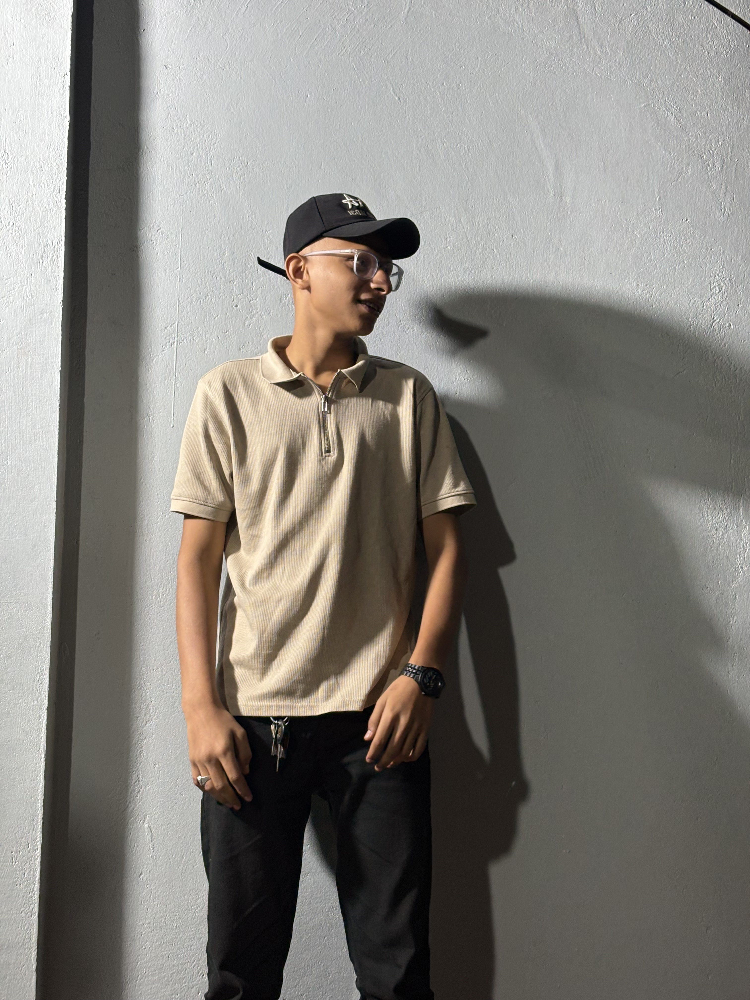

<!-- Abrar Akhunji Portfolio README -->

<!-- BRUTAL HONESTY NOTE: Replace the "HEADER_GIF_URL" below with a screen recording of your actual 3D website.
Without it, your README is just text. Visuals sell. -->

<h1 align="center">Abrar Akhunji</h1>

<!-- Typing SVG Animation -->

<b>AI/ML Engineer</b> • <b>Full Stack Developer</b> • <b>Python Specialist</b>

👨‍💻 About Me

I bridge the gap between complex AI models and scalable web architectures. Currently pursuing a B.E. in Information Technology in Gujarat, India. I don't just write code; I build systems that see, think, and solve real-world problems—from detecting brain tumors using MRI data to identifying AI-generated forgeries.

const abrar = {
    role: "AI/ML Engineer & Full Stack Dev",
    location: "Gujarat, India",
    code: ["Python", "Java", "JavaScript", "PHP"],
    passion: "Teaching machines to see & think securely",
    current_status: "Open to Work"
};

🛠️ Technical Arsenal

Artificial Intelligence & Data Science

Web Development & Frameworks

Tools & Platforms

🚀 Selected Projects

Project

Category

Tech Stack

Description

Real vs AI Detector

Computer Vision

Python OpenCV TensorFlow

A forensic system detecting AI-generated forgeries using Vision Transformers and noise pattern analysis.

Cattle Breed ID

AI/ML

ViT Python Deep Learning

Ensemble-based AI classifying 41 distinct Indian cattle breeds with high accuracy.

Brain Tumor Detection

Healthcare AI

OpenCV NumPy Pandas

Automated MRI analysis system using contour detection and thresholding to identify tumors.

Kid’s Space

Android

Java XML Android Studio

An interactive educational app for children with a modular UI design.

⚡ GitHub Stats

💻 Running the Portfolio Locally

This portfolio is built with React + Vite and utilizes Three.js for 3D rendering.

# 1. Clone the repository
git clone [https://github.com/abrar225/Abrar-Akhunji.git](https://github.com/abrar225/Abrar-Akhunji.git)

# 2. Navigate to directory
cd Abrar-Akhunji

# 3. Install dependencies
npm install

# 4. Start the development server
npm run dev

© 2025 Abrar Akhunji. Built with code, caffeine, and linear algebra.

